[](http://creativecommons.org/licenses/by/4.0/)

<p align="center">
  <h3 align="center">Linux Laravel</h3>

  <p align="center">
    Virtual Machine
    <br />
  </p>
</p>

## Introdução

Este documento visa fornecer uma guia sobre como configurar um ambiente IaaS na IBM Cloud de forma a configurar uma Máquina Virtual e configurar uma aplicação laravel e expô-la na internet.

## Passo a Passo

### Chave SSH na IBM Cloud

Antes de mais nada para que seja possívle seguir corretamente esse tutorial é preciso criar uma chave ssh pois ela será utilizada para acessar a máquina virtual criada e realizar as operações necessárias para disponibilizar a aplicação. Existem muitos métodos e tutoriais de como criar uma chave sshm recomendamos fortemente o disponibilizado pelo [GitHub](https://docs.github.com/pt/authentication/connecting-to-github-with-ssh/generating-a-new-ssh-key-and-adding-it-to-the-ssh-agent), siga somente os passos da seção "Gerar uma nova chave SSH", ao final desses passos você deve ter em seu diretório dois arquivos, uma chave pública e uma privada. A chave privada você deverá renomear para `cred.pem` pois este será o nome utilizada pelo tutorial.

De posse das chaves acesse a IBM Cloud: https://cloud.ibm.com/

1.  No painel inicial, clique no menu no canto superior esquerdo, selecione a opção VPC e depois SSH.
    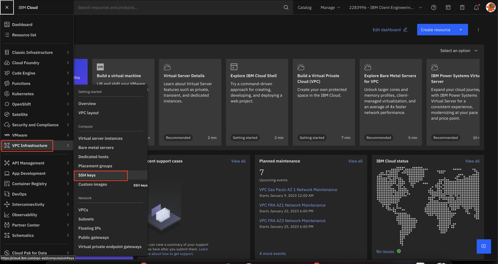

2.  Com o painel de chaves aberto vamos carregar nossa nova chave, clique no botão "Create" do lado diretiro na tela.
    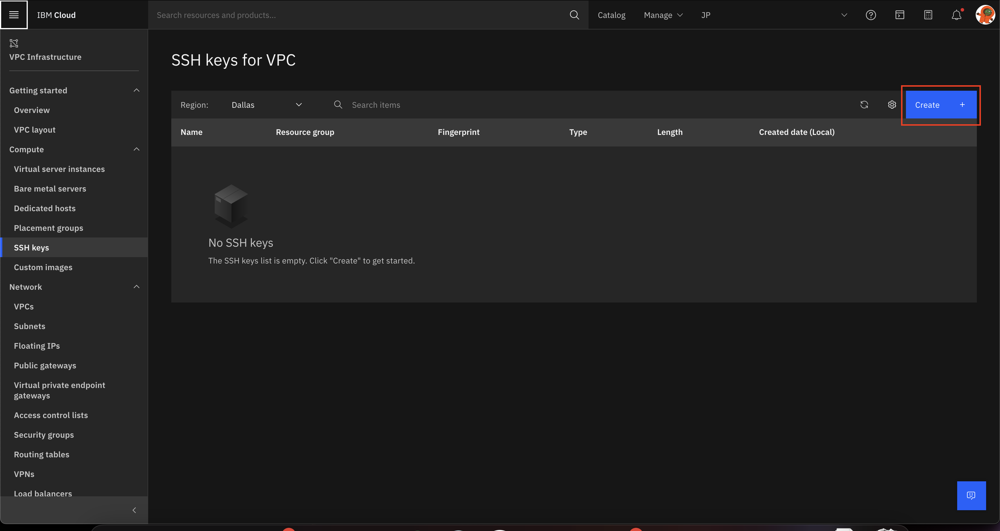

3.  Escolha a localização de armazenamento da chave, de um nome para a chave e cole a chave pública no espaço "Public Key", apos isso clique em "Create"
    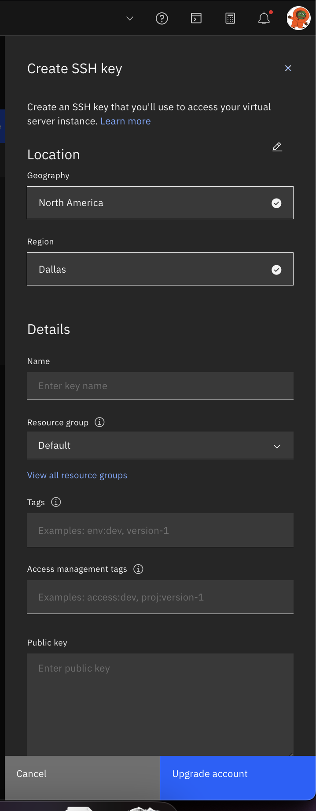

4.  A chave deve aparecer no painel de chaves

5.  Com chave criada e carregada agorá e preciso criar a rede privada onde a nossa aplicação irá rodar. Do lado esquerdo, clique em VPCs.
    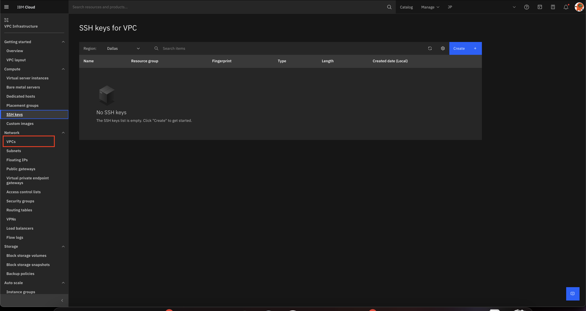

6.  Do lado direito, clique no botão "Create" para criar uma nova VPC
    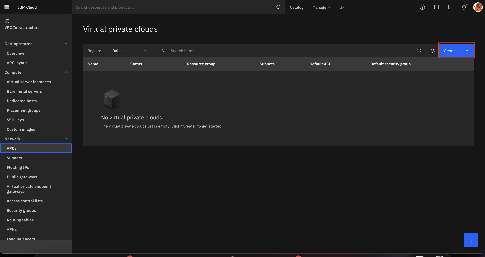

7.  Escolha onde ela será criada e de um nome a ela, em seguinda basta clicar no botão "Create virtual private cloud"
    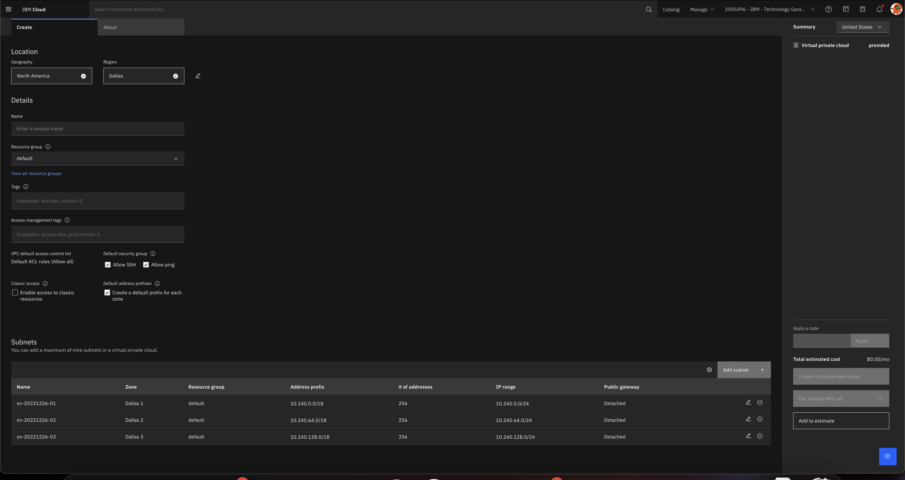

8.  Uma vez com a rede criada, agora é necessário criar a máquina virtual para executar a aplicação. Do lado esquerdo, clique em "Virtual server instances"
    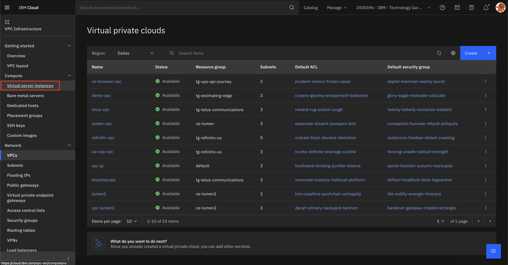

9.  Clique no botão "Create" do lado direto da tela.
    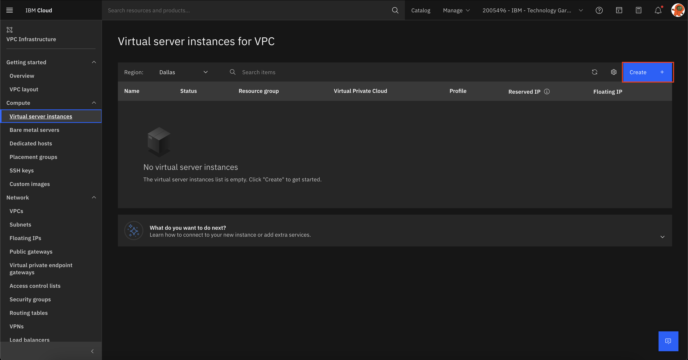

10. Configure a máqina de acordo com sua necessidade. Aqui o importante é associar a essa maquina a VPC criada no passo 7 e com a chave ssh do passo 1 para que tenhamos acesso. Selecione a o sitema operacional que melhor se adeque a suas necessidades, neste tutorial foi utilizado o Ubuntu.
    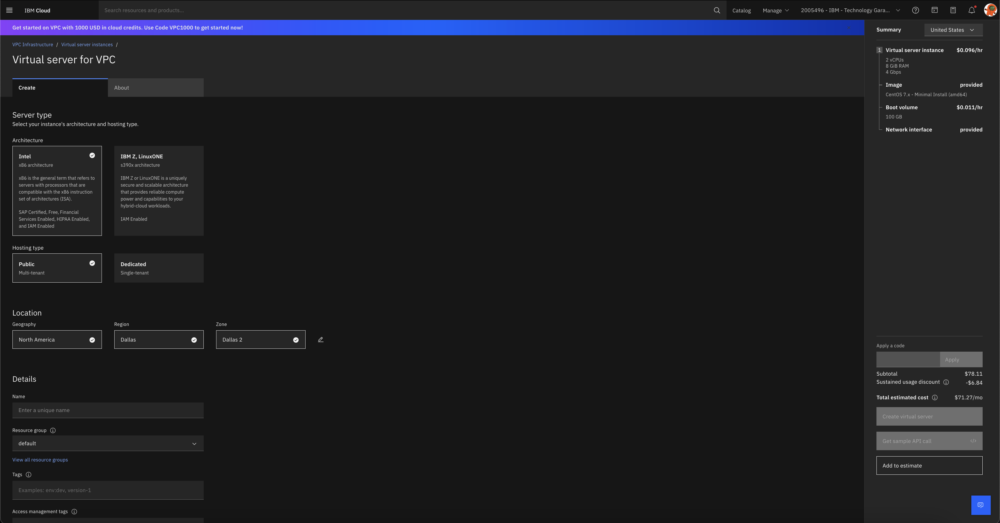

11. Com a máquina virtual criada, agora é necessário expor ela para que seja possível acessá-la. Para isso clique em "Floating IPs" do lado esquerdo.
    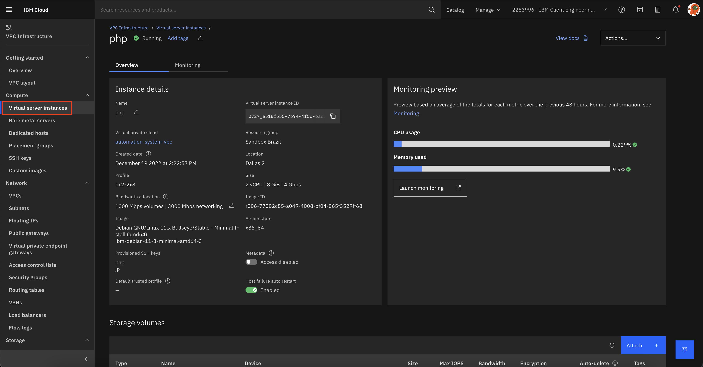

12. Vamos criar um IP para acessar a máquina. Clique em "Reserve" do lado direito da tela.
    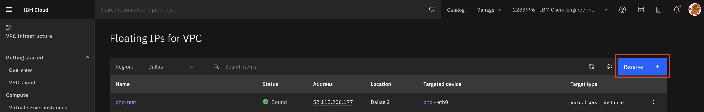

13. Selecione a região, de um nome e selecione a vm crida para que o IP seja associado a ela. Em seguida clique em "Reserve".
    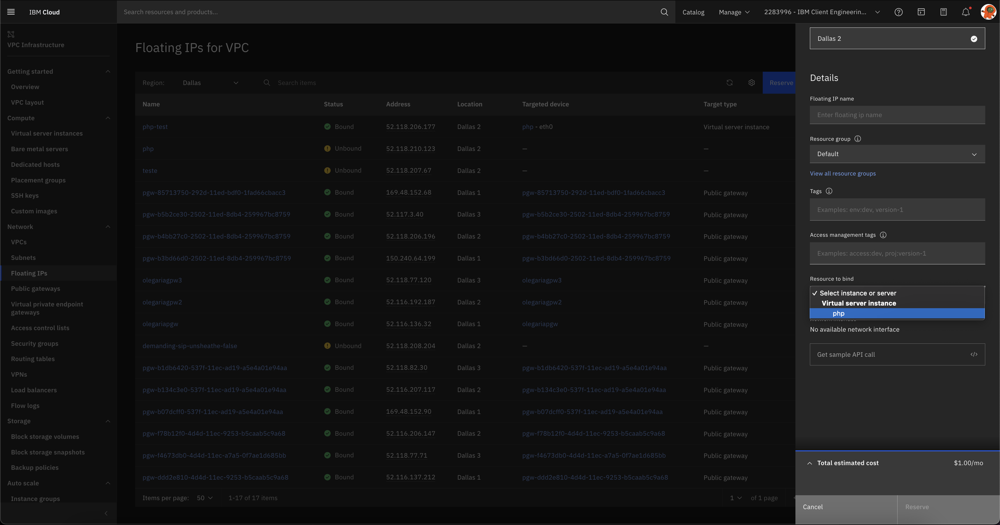

14. Agora com o IP alocado já é possivel acessar a VM via ssh. Guarde esse IP pois ele será utilizado para acessar sua VM

15. Para que seja possivel disponibilizar sua aplicação na internet é preciso liberar a porta 80 e 443. Para isso acesse sua vm clicanco em "Virtual server intances" do lado esquerdo.
    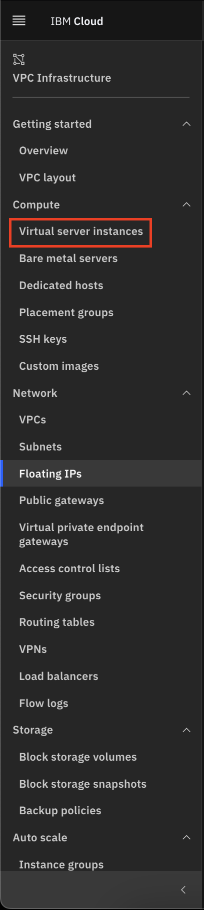

16. Clique no nome da VM para acessar suas configurações.
    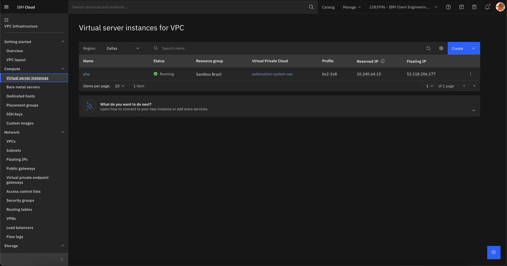

17. Na parte inferior da página, existe uma seção para configurar a interface de rede. Clique no grupo de segurança.
    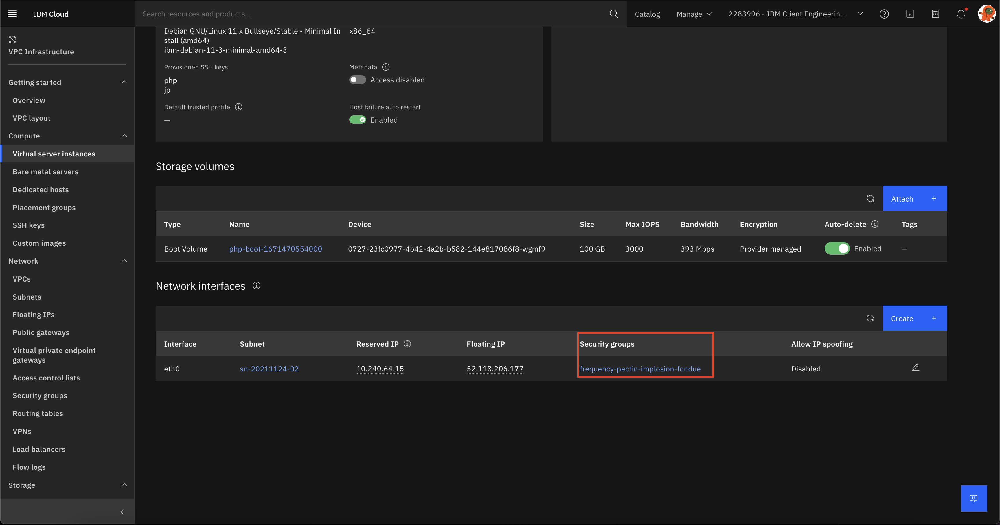

18. Precisamos criar uma regra nova habilitar a exposição da vm a internet. Para isso clique em "Rules".
    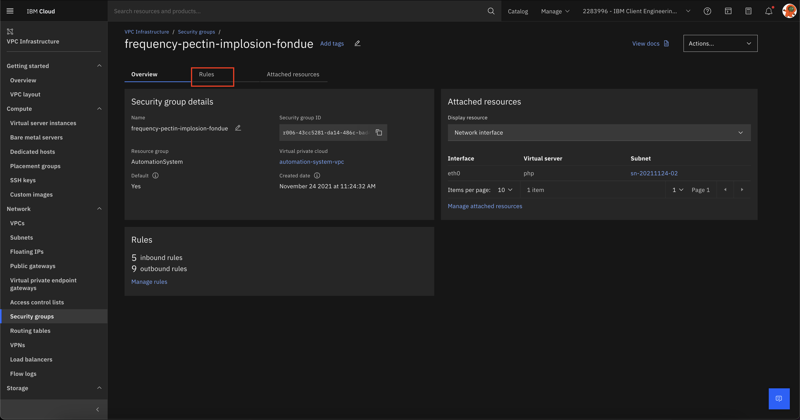

19. Em Rules, clique no botão "Create" na seção "Inbound rules"
    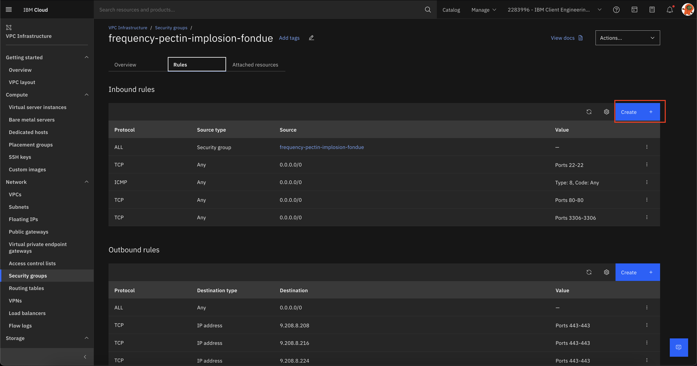

20. Mantenha o protocolo como TCP, e adicione a porta 80. Em seguinda clique em "Create".
    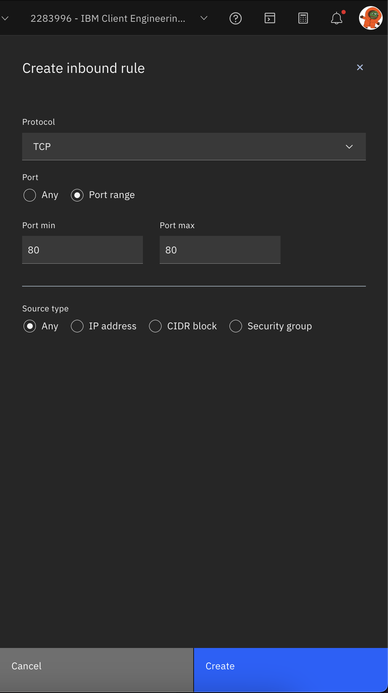

21. Repita o passo 20 caso queria liberar a porta 443.

Ao final dessa etapa voce dever ter em mãos a chave privada ssh e o IP de acesso da VM, com isso está pronto para serguir em frente.

### Acessando a VM

É necessário criar o arquivo da credencial (cred.pem) dentro de uma pasta em sua máquina, após isso é preciso acessá-la através do terminal e utilizar o comando

```
ssh -i cred.pem root@<IPdaVM>
```

Caso tenha problemas de permissão para acessar a VM, utilize o comando

```
chmod 700 cred.pem para resolver
```

### Instalando o Apache

Primeiro precisamos instalar o Apache Web Server usando o comando

```
apt install apache2
```

Caso esteja utilizando algum firewall, é necessário utilizar o comando

```
ufw allow “Apache Full”
```

Ele irá fornecer as permissōes necessárias.

Após isso, para verificar o status do Apache e garantir que ele está funcionando, execute o comando

```
systemctl status apache2
```

E então acesse o IP de sua VM pelo browser para ver a página criada pelo Apache.

### Instalando o PHP

Para instalar o PHP utilize o comando

```
apt install php libapache2-mod-php php-mbstring php-xmlrpc php-soap php-gd php-xml php-cli php-zip php-bcmath php-tokenizer php-json php-pear
```

e atualize seu sistema com

```
apt-get update
```

### Configurando o ambiente

Para criar um arquivo na raiz pasta do Apache, utilize o comando

```
nano /var/www/html/<nomeDoArquivo>
```

e adicione ao arquivo as seguintes linhas

```
<?php
  phpinfo();
?>
```

Também vamos precisar do banco de dados, para isso basta o comando

```
apt install mariadb-server
```

Instale o Composer que será utilizado para criar o projeto Laravel com o comando

```
url -sS https://getcomposer.org/installer | php
```

e após isso, para garantir que o Composer será utilizado globalmente, execute os seguintes comandos

```
mv composer.phar /usr/local/bin/composer
```

```
chmod +x /usr/local/bin/composer
```

Agora iremos criar o projeto, vamos executar uma série de comandos

- Para criar o projeto

  ```
  composer create-project --prefer-dist laravel/laravel <NomeDoProjeto>
  ```

- Para acessar o diretório do projeto

  ```
  cd <NomeDoProjeto>
  ```

- Para configurar o ambiente

  ```
  serve --host=<SeuIP> --port=<PortaDesejada>
  ```

Para rodar o projeto precisamos move-lo para a pasta raiz do Apache com o comando

```
mv <NomeDoProjeto> /var/www/html/
```

Também vamos fornecer as permissões necessárias para que o projeto funcione corretamente com os comandos

```
chgrp -R www-data /var/www/html/<NomeDoProjeto>/
```

```
chmod -R 775 /var/www/html/<NomeDoProjeto>/storage
```

Agora para criar um host virtual, vamos acessar o diretório correto com

```
cd /etc/apache2/sites-available
```

Em seguida o comando para criar o arquivo de configuração

```
nano laravel_project.conf
```

e adicione o seguinte código à ele

```
<VirtualHost *:80>
   ServerName thedomain.com
   ServerAdmin webmaster@thedomain.com
   DocumentRoot /var/www/html/example/public

   <Directory /var/www/html/example>
       AllowOverride All
   </Directory>
   ErrorLog ${APACHE_LOG_DIR}/error.log
   CustomLog ${APACHE_LOG_DIR}/access.log combined
</VirtualHost>
```

Após isso desative a configuração padrão do host com

```
a2dissite 000-default.conf
```

Ative nosso host virtual com

```
a2ensite laravel_project
```

Por fim, ative o modulo de reescrita com

```
a2enmod rewrite
```

e reinicie o Apache usando

```
systemctl restart apache2
```

### Criando o projeto

Agora que temos todo o ambiente criado e configurado, vamos criar um modulo de exemplo para ver melhor o funcionamento do Laravel e testar a conexão com o banco.

Primeiro vamos criar um model chamado **Company**, acesse o diretório do projeto com

```
cd /var/www/html/<NomeDoProjeto>/
```

Agora execute

```
php artisan make:model Company –m
```

Em seguida acesse o diretório

```
database/migrations/
```

e adicione ao arquivo de migration de **Company** o seguinte código

```
public function up() {

  Schema::create('companies', function (Blueprint $table) {

    $table->id();

    $table->string('name');

    $table->string('email');

    $table->string('address');

    $table->timestamps();

  });

}
```

Depois acesse a pasta app/Models e adicione o seguinte código ao arquivo **Company.php**

```
<?php

  namespace App\Models;

  use Illuminate\Database\Eloquent\Factories\HasFactory;

  use Illuminate\Database\Eloquent\Model;

  class Company extends Model {

    use HasFactory; protected $fillable = ['name', 'email', 'address'];

  }

?>
```

Acesse a raiz do projeto e execute o comando abaixo para criar as tabelas no banco de dados

```
php artisan migrate
```

Vamos então, criar o Controller para esse modelo, utilizaremos o comando

```
php artisan make:controller CompanyController
```

Depois disso acesse o repositório

```
app/Http/Controllers
```

e adicione o seguinte código ao arquivo **CompanyController.php**

```
<?php

  namespace App\Http\Controllers;

  use App\Models\Company;

  use Illuminate\Http\Request;


  class CompanyController extends Controller

  {
      /**

      * Display a listing of the resource.
      *
      * @return \Illuminate\Http\Response
      */

      public function index()
      {
          $companies = Company::orderBy('id','desc')->paginate(5);

          return view('companies.index', compact('companies'));
      }

      /**
      * Show the form for creating a new resource.
      *
      * @return \Illuminate\Http\Response
      */

      public function create()
      {
          return view('companies.create');
      }

      /**
      * Store a newly created resource in storage.
      *
      * @param  \Illuminate\Http\Request  $request
      * @return \Illuminate\Http\Response
      */

      public function store(Request $request)
      {
          $request->validate([

              'name' => 'required',

              'email' => 'required',

              'address' => 'required',
          ]);

          Company::create($request->post());

          return redirect()->route('companies.index')->with('success','Company has been created successfully.');
      }

      /**
      * Display the specified resource.
      *
      * @param  \App\company  $company
      * @return \Illuminate\Http\Response
      */

      public function show(Company $company)
      {
          return view('companies.show',compact('company'));
      }

      /**
      * Show the form for editing the specified resource.
      *
      * @param  \App\Company  $company
      * @return \Illuminate\Http\Response
      */

      public function edit(Company $company)
      {
          return view('companies.edit',compact('company'));
      }

      /**
      * Update the specified resource in storage.
      *
      * @param  \Illuminate\Http\Request  $request
      * @param  \App\company  $company
      * @return \Illuminate\Http\Response
      */

      public function update(Request $request, Company $company)
      {
          $request->validate([

              'name' => 'required',

              'email' => 'required',

              'address' => 'required',
          ]);

          $company->fill($request->post())->save();

          return redirect()->route('companies.index')->with('success','Company Has Been updated successfully');
      }

      /**
      * Remove the specified resource from storage.
      *
      * @param  \App\Company  $company
      * @return \Illuminate\Http\Response
      */

      public function destroy(Company $company)
      {
          $company->delete();

          return redirect()->route('companies.index')->with('success','Company has been deleted successfully');
      }
  }
```

Vamos então criar as rotas necessárias para acessar esse controller, acesse o diretório **routes** e adicione o código abaixo ao arquivo **web.php**

```
use App\Http\Controllers\CompanyController;

Route::resource('companies', CompanyController::class);
```

### .env

É preciso ter certeza que o arquivo **.env** está configurado corretamente para a conexão com o banco de dados

```
DB_CONNECTION=mysql
DB_HOST=localhost
DB_PORT=<PortaSQL>
DB_DATABASE=<NomeBanco>
DB_USERNAME=<UsuarioDoBanco>
DB_PASSWORD=<SenhaDoUsuario>
```

### Criando as telas

Agora, iremos criar as telas para acessar através dessa rota, primeiro acesse o diretório **resources/views** e crie uma nova pasta chamada **companies**, dentro delas vamos precisar de 3 telas:

- index.blade.php

  ```
  <!DOCTYPE html>
  <html lang="en">
    <head>

      <meta charset="UTF-8">

      <title>Laravel 9 CRUD Tutorial Example</title>
      <link rel="stylesheet" href="https://stackpath.bootstrapcdn.com/bootstrap/4.5.2/css/bootstrap.min.css" >

    </head>
    <body>
      <div class="container mt-2">
        <div class="row">
            <div class="col-lg-12 margin-tb">
                <div class="pull-left">

                    <h2>Laravel 9 CRUD Example Tutorial</h2>

                </div>
                <div class="pull-right mb-2">

                    <a class="btn btn-success" href="{{ route('companies.create') }}"> Create Company</a>

                </div>
              </div>
        </div>

        @if ($message = Session::get('success'))
            <div class="alert alert-success">
                <p>{{ $message }}</p>
            </div>
        @endif

        <table class="table table-bordered">
            <thead>
                <tr>
                    <th>S.No</th>

                    <th>Company Name</th>

                    <th>Company Email</th>

                    <th>Company Address</th>

                    <th width="280px">Action</th>
                </tr>
            </thead>
            <tbody>
                @foreach ($companies as $company)
                    <tr>
                        <td>{{ $company->id }}</td>

                        <td>{{ $company->name }}</td>

                        <td>{{ $company->email }}</td>

                        <td>{{ $company->address }}</td>

                        <td>
                            <form action="{{ route('companies.destroy',$company->id) }}" method="Post">

                                <a class="btn btn-primary" href="{{ route('companies.edit',$company->id) }}">Edit</a>

                                @csrf

                                @method('DELETE')

                                <button type="submit" class="btn btn-danger">Delete</button>
                            </form>
                        </td>
                    </tr>
                    @endforeach
            </tbody>
        </table>

        {!! $companies->links() !!}

      </div>
    </body>
  </html>
  ```

- create.blade.php

  ```
  <!DOCTYPE html>
  <html lang="en">
    <head>

      <meta charset="UTF-8">
      <title>Add Company Form - Laravel 9 CRUD</title>
      <link rel="stylesheet" href="https://stackpath.bootstrapcdn.com/bootstrap/4.5.2/css/bootstrap.min.css">

    </head>
    <body>
      <div class="container mt-2">
          <div class="row">
              <div class="col-lg-12 margin-tb">
                  <div class="pull-left mb-2">

                      <h2>Add Company</h2>

                  </div>
                  <div class="pull-right">

                      <a class="btn btn-primary" href="{{ route('companies.index') }}"> Back</a>

                  </div>
              </div>
          </div>

          @if(session('status'))

            <div class="alert alert-success mb-1 mt-1">

                {{ session('status') }}

            </div>

          @endif

          <form action="{{ route('companies.store') }}" method="POST" enctype="multipart/form-data">
              @csrf
              <div class="row">
                  <div class="col-xs-12 col-sm-12 col-md-12">
                      <div class="form-group">

                          <strong>Company Name:</strong>

                          <input type="text" name="name" class="form-control" placeholder="Company Name">

                          @error('name')

                          <div class="alert alert-danger mt-1 mb-1">{{ $message }}</div>

                          @enderror

                      </div>
                  </div>
                  <div class="col-xs-12 col-sm-12 col-md-12">
                      <div class="form-group">

                          <strong>Company Email:</strong>

                          <input type="email" name="email" class="form-control" placeholder="Company Email">

                          @error('email')

                          <div class="alert alert-danger mt-1 mb-1">{{ $message }}</div>

                          @enderror

                      </div>
                  </div>
                  <div class="col-xs-12 col-sm-12 col-md-12">
                      <div class="form-group">

                          <strong>Company Address:</strong>

                          <input type="text" name="address" class="form-control" placeholder="Company Address">

                          @error('address')

                          <div class="alert alert-danger mt-1 mb-1">{{ $message }}</div>

                          @enderror
                      </div>
                  </div>

                  <button type="submit" class="btn btn-primary ml-3">Submit</button>

              </div>
          </form>
      </div>
   </body>
  </html>
  ```

- edit.blade.php

  ```
  <!DOCTYPE html>
  <html lang="en">
    <head>

      <meta charset="UTF-8">
      <title>Edit Company Form - Laravel 9 CRUD Tutorial</title>
      <link rel="stylesheet" href="https://stackpath.bootstrapcdn.com/bootstrap/4.5.2/css/bootstrap.min.css">

    </head>
    <body>
      <div class="container mt-2">
          <div class="row">
              <div class="col-lg-12 margin-tb">
                  <div class="pull-left">

                      <h2>Edit Company</h2>

                  </div>
                  <div class="pull-right">

                      <a class="btn btn-primary" href="{{ route('companies.index') }}" enctype="multipart/form-data">

                          Back</a>

                  </div>
              </div>
          </div>

          @if(session('status'))

            <div class="alert alert-success mb-1 mt-1">

                {{ session('status') }}

            </div>

          @endif

          <form action="{{ route('companies.update',$company->id) }}" method="POST" enctype="multipart/form-data">
              @csrf
              @method('PUT')

              <div class="row">
                  <div class="col-xs-12 col-sm-12 col-md-12">
                      <div class="form-group">

                          <strong>Company Name:</strong>

                          <input type="text" name="name" value="{{ $company->name }}" class="form-control"

                              placeholder="Company name">

                          @error('name')

                            <div class="alert alert-danger mt-1 mb-1">{{ $message }}</div>

                          @enderror

                      </div>
                  </div>
                  <div class="col-xs-12 col-sm-12 col-md-12">
                      <div class="form-group">

                          <strong>Company Email:</strong>

                          <input type="email" name="email" class="form-control" placeholder="Company Email"

                              value="{{ $company->email }}">

                          @error('email')

                            <div class="alert alert-danger mt-1 mb-1">{{ $message }}</div>

                          @enderror

                      </div>
                  </div>
                  <div class="col-xs-12 col-sm-12 col-md-12">
                      <div class="form-group">

                          <strong>Company Address:</strong>

                          <input type="text" name="address" value="{{ $company->address }}" class="form-control"

                              placeholder="Company Address">

                          @error('address')

                          <div class="alert alert-danger mt-1 mb-1">{{ $message }}</div>

                          @enderror

                      </div>
                  </div>

                  <button type="submit" class="btn btn-primary ml-3">Submit</button>

              </div>
          </form>
      </div>
    </body>
  </html>
  ```

Finalmente, para executar seu projeto, utilize o comando

```
php artisan serve
```

e acesse via URL

```
http://<SeuIP>/companies
```

## Referências

- [Criação de Frontend publico e backend privado](https://cloud.ibm.com/docs/vpc?topic=solution-tutorials-vpc-public-app-private-backend)
- ["Como Instalar Laravel no Ubunbtu"](https://www.hostinger.com/tutorials/how-to-install-laravel-on-ubuntu-18-04-with-apache-and-php/)
- [CRUD no Laravel](https://techvblogs.com/blog/laravel-9-crud-application-tutorial-with-example)

## Autores

- Gabriel Felisberto Pires
- João Pedro Poloni Ponce

## Licença

<a rel="license" href="http://creativecommons.org/licenses/by/4.0/"></a><br />This work is licensed under a <a rel="license" href="http://creativecommons.org/licenses/by/4.0/">Creative Commons Attribution 4.0 International License</a>.
